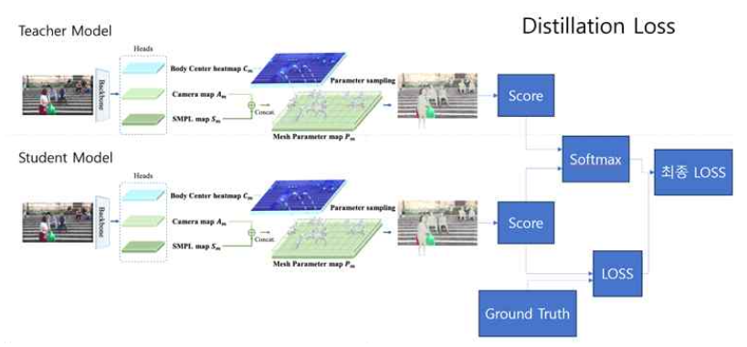
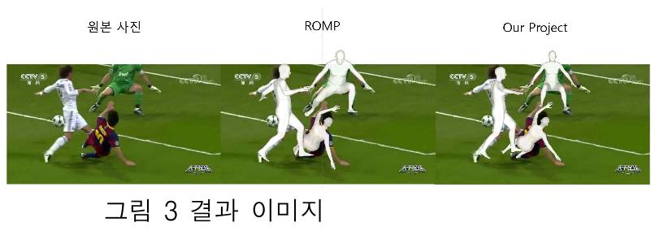
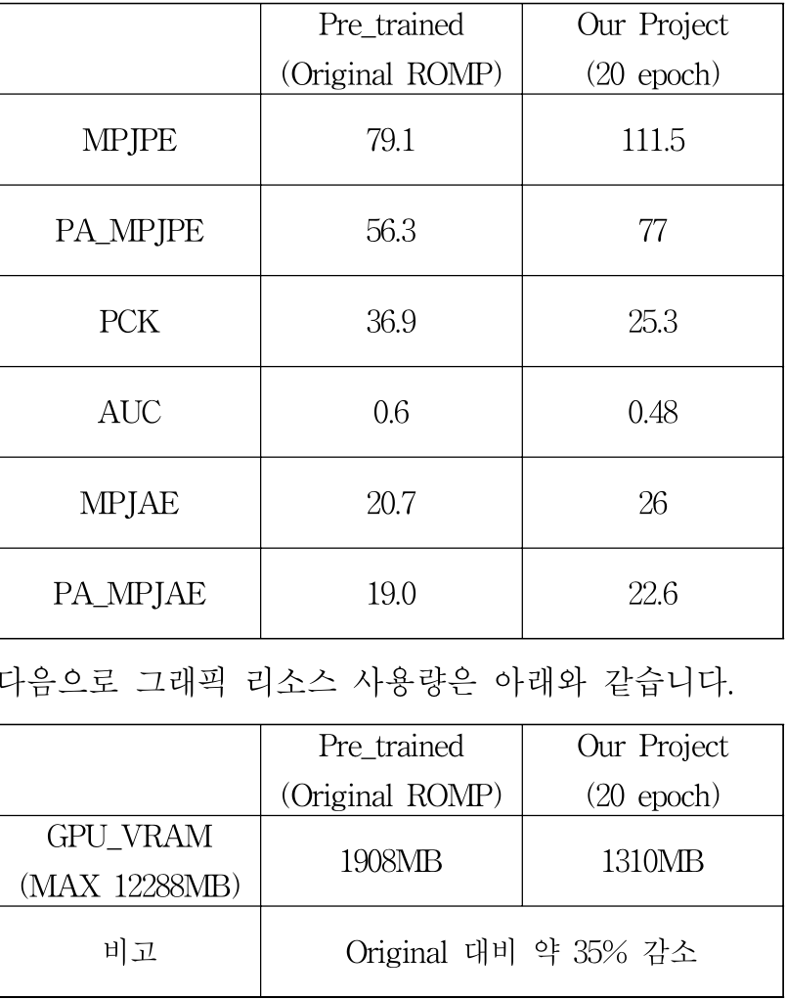

# ROMP + 지식 증류 (Knowledge Distillation, KD)

이 코드는 ROMP(Monocular One-stage Regression of Multiple 3D People) 모델에 지식 증류를 적용하여 컴퓨팅 리소스를 절감하는 방법을 제시합니다. 본 연구에서는 ResNet-50을 백본으로 한 ROMP를 Teacher 모델로, ResNet-18을 백본으로 한 더 작은 ROMP 모델을 Student 모델로 설정하여 지식 증류를 수행했습니다. 그 결과, 성능을 유지하면서 약 35%의 컴퓨팅 리소스 절감을 달성했습니다.

## 지식 증류 과정

위 그림은 본 연구에 적용된 지식 증류 아키텍처를 나타냅니다. Teacher 모델의 지식을 Student 모델에 효과적으로 전달하는 구조로, 리소스 사용을 최소화하면서도 높은 성능을 유지하는 것이 목적입니다.

## 결과 예시

위 이미지는 원본 ROMP 모델과 본 연구에서 개발된 경량화된 모델의 결과를 비교한 것입니다. 시각적으로 큰 차이가 없는 결과를 확인할 수 있습니다.

### ROMP vs 최적화된 모델 비교

### 학습 모델 다운로드

용량이 매우 커서 구글 드라이브에 올려 두었습니다.

https://drive.google.com/file/d/1GUbRLU4b3oeR9rxvUGFpBIotrB63HO1i/view?usp=drive_link

### 참조

- https://github.com/Arthur151/ROMP?tab=readme-ov-file
